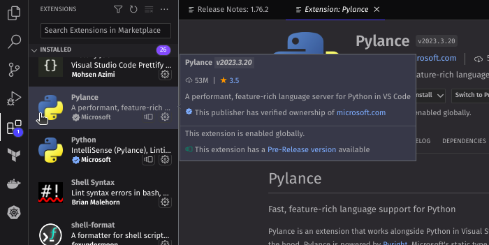
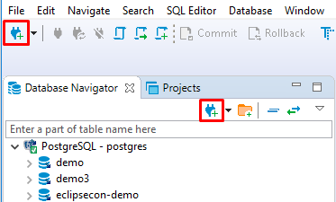
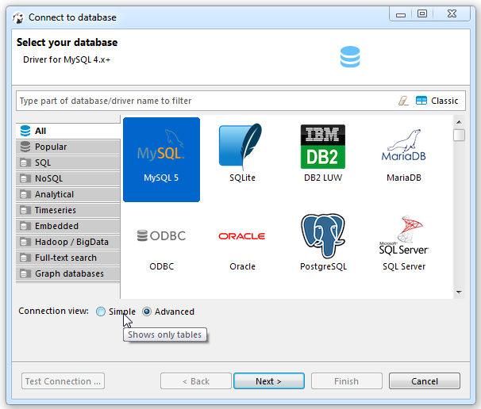
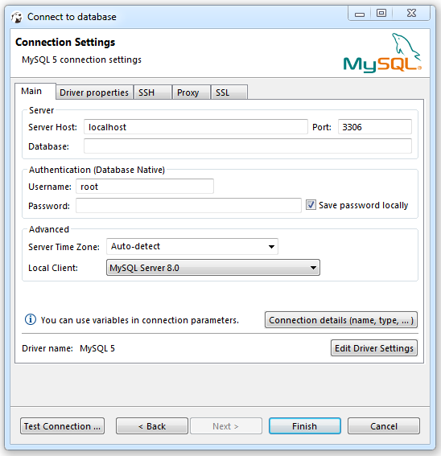
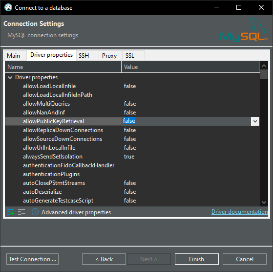

# Criação de ambiente cloud/back-end

## Introdução

Olá, aluno(a) do Start Future! Tudo certo? Hoje iremos realizar o processo de instalação e configuração dos principais recursos, ferramentas e do sistema operacional que mais usaremos nas aulas relacionadas a back-end e cloud computing!

A lista completa é a seguinte:

- Python 3
- Visual Studio Code
- Extensões do VSCode
- WSL2
- Docker
  - Instalando o Docker no Windows & Linux
  - Instalando o Mysql dentro do Docker
- Testando o banco
- AWS CLI

## **1. Python 3**

Primeiro, você precisa baixar o instalador do Python 3 no site oficial da linguagem. Escolha a versão mais recente e compatível com o seu sistema operacional (Windows, macOS ou Linux).

Em seguida, execute o arquivo de instalação e siga as instruções na tela. Se você não estiver familiarizado com as configurações de instalação, deixe as opções padrão selecionadas.

Depois de instalado, abra o seu terminal e digite **`python3`** para verificar se a instalação foi concluída com sucesso. Se tudo estiver funcionando corretamente, você deve ver uma mensagem de boas-vindas do Python.

## Linux

```bash
sudo apt install python3
curl https://bootstrap.pypa.io/get-pip.py -o get-pip.py
python3 get-pip.py
rm get-pip.py
python3 -m pip install pip
python3 -m pip install virtualenv
```

## **2. Visual Studio Code**

Agora vamos instalar o Visual Studio Code, um editor de código leve e poderoso que suporta várias linguagens de programação. Para isso, baixe o instalador do VS Code no site oficial e execute-o.

Assim como no caso do Python, as opções padrão geralmente são suficientes para a instalação. Quando a instalação estiver concluída, abra o VS Code e aproveite!

## **3. Extensões do VSCode**

Para tornar o VS Code ainda mais poderoso, você pode instalar extensões. Existem centenas de extensões disponíveis no VS Code Marketplace, então você pode escolher aquelas que melhor atendem às suas necessidades.

Para instalar uma extensão, basta abrir o VS Code e clicar no ícone de extensões no canto esquerdo da barra lateral. Em seguida, pesquise pela extensão que deseja e clique no botão "Instalar". Depois que a extensão for instalada, você pode ativá-la clicando no botão "Ativar".



Extensões recomendadas:

- Pylance (ms-python.vscode-pylance)
- Docker (ms-azuretools.vscode-docker)
- Python (ms-python.python)
- AutoDocString (njpwerner.autodocstring)

## **4. WSL2**

Agora vamos instalar o WSL2, uma ferramenta que permite executar o Linux em um ambiente virtual dentro do Windows. Isso é especialmente útil se você estiver desenvolvendo aplicativos que serão executados em servidores Linux.

Primeiro, verifique se o seu Windows 10 tem a atualização mais recente instalada. Em seguida, abra o "Painel de Controle", vá para "Programas" e clique em "Ativar ou desativar recursos do Windows".

Procure por "Subsistema do Windows para Linux" e marque a caixa de seleção. Depois de selecionar a opção, clique em "OK" e aguarde a instalação.

## **5. Docker**

O Docker é uma plataforma de contêineres que permite criar, implantar e executar aplicativos em ambientes isolados. Isso ajuda a garantir que o seu aplicativo funcione de maneira consistente em diferentes ambientes.

Para instalar o Docker, vá ao site oficial e baixe o instalador para o seu sistema operacional. Siga as instruções na tela para concluir a instalação.

### Nativamente no linux

#### Configurando

```bash

sudo apt update && sudo apt upgrade -y

sudo apt --fix-broken install -y

sudo apt install docker.io -y

curl -fsSL https://get.docker.com/ | sh

sudo usermod -a -G docker $USER

```

#### Executando

```bash

sudo docker ps

```

### Docker dentro do wsl2

#### Configurando wsl2

  ```bash
  ## Configuração Docker nativo

  ## Instalando Pre-requitos

  sudo apt update && sudo apt upgrade -y
  sudo apt remove docker docker-engine docker.io containerd runc -y
  sudo apt-get install \
      apt-transport-https \
      ca-certificates \
      curl \
      gnupg \
      lsb-release -y

  ## Adicione o repositório do Docker na lista de sources do Ubuntu:

  curl -fsSL https://download.docker.com/linux/ubuntu/gpg | sudo gpg --dearmor -o /usr/share/keyrings/docker-archive-keyring.gpg
  echo \
    "deb [arch=amd64 signed-by=/usr/share/keyrings/docker-archive-keyring.gpg] https://download.docker.com/linux/ubuntu \
    $(lsb_release -cs) stable" | sudo tee /etc/apt/sources.list.d/docker.list > /dev/null

  ## Instalando docker engine

  sudo apt update && sudo apt upgrade -y
  sudo apt-get install docker-ce docker-ce-cli containerd.io -y

  ## Dê permissão para rodar o Docker com seu usuário corrente:

  sudo usermod -aG docker $USER

  ## Instale o Docker Compose:

  sudo curl -L "https://github.com/docker/compose/releases/download/1.29.1/docker-compose-$(uname -s)-$(uname -m)" -o /usr/local/bin/docker-compose
  sudo chmod a+x /usr/local/bin/docker-compose

  sudo ln -s /usr/local/bin/docker-compose /usr/bin/docker-compose
  ```

#### Executando wsl2

```bash
sudo dockerd > /dev/null 2>&1 &
```

### **Mysql**

#### Criando o Container do Mysql

```bash
docker run --name=mysql_boot -p3306:3306 -v mysql-volume:/var/lib/mysql -e MYSQL_ROOT_PASSWORD=admin -d mysql/mysql-server:5.7
```

> Caso a configuração do mysql no docker seja feita dentro do wsl2 o proximo passo precisa ser realizado

Rodar um de cada vez

```bash
docker exec -it mysql_boot bash # se de certo voce entrara dentro do container
```

```bash
mysql -u root -p # se der certo voce entrara dentro do mysql
```

```bash
update mysql.user set host = '%' where user='root'; # habilite conexões de outros locais
```

```bash
FLUSH PRIVILEGES; # atualize os privilegios
```

## **6. Testando banco de dados**

### DBeaver

#### Configurando DBeaver

1. Baixe e instale o [DBeaver](https://dbeaver.io/)

2. Clique na opção para criar conexão:

  

3. Selecione a opção "Mysql"

  

4. Preencha as informações de usuário e senha 

  

5. Clique em "Driver properties" e depois coloque a opção "allowPublicKeyRetrieval" para "true"

  

6. Clique em test connection e pronto ;)

## **7. AWS CLI**

Finalmente, vamos instalar a AWS CLI, uma ferramenta de linha de comando que permite gerenciar os serviços da Amazon Web Services. Isso é especialmente útil se você estiver trabalhando com infraestrutura na nuvem.

Para instalar a AWS CLI, abra o seu terminal e digite o seguinte comando:

```yaml
pip3 install awscli --upgrade --user
```

Isso instalará o AWS CLI usando o gerenciador de pacotes Python, o **`pip3`**. Se tudo ocorrer bem, a instalação será concluída em alguns minutos.

Depois que a AWS CLI estiver instalada, você precisará configurá-la com suas credenciais da AWS. Para fazer isso, execute o seguinte comando no terminal:

```yaml
aws configure
```

Em seguida, siga as instruções na tela para fornecer suas credenciais da AWS (ID de acesso e chave de acesso) e definir a região padrão. Quando terminar, a AWS CLI estará pronta para uso.

E pronto! Agora você tem todas as ferramentas necessárias para começar a programar em Python e trabalhar com desenvolvimento de aplicativos na nuvem com a AWS CLI.
